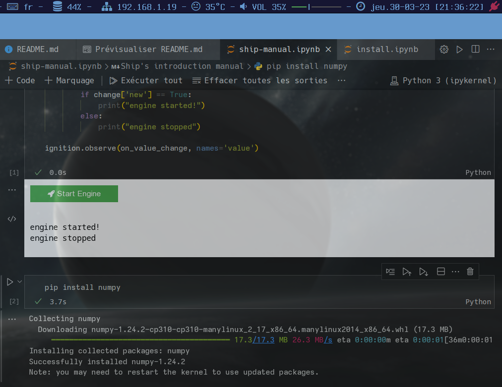
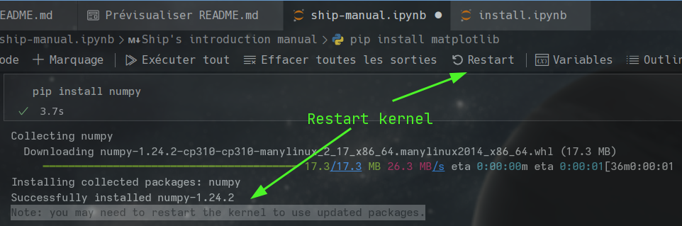

# Creation d'un notebook Jupyter sur Gnu-Linux (Achlinux)

## Steps to see Jupyter books, needs Python & virtualenv

Clone repo :

```bash
git clone https://github.com/rnek0/myJupyterVenv
```

Enter on folder :

```bash
cd myJupyterVenv
```

Activate virtualenv :

```bash
virtualenv myJupyterVenv_env
```

Source it

```bash
source myJupyterVenv_env/bin/activate
```

Install requirements

```bash
pip install -r requirements.txt
```

Launch Jupyter books

```bash
jupyter notebook
```

Go to the web page and enjoy reading.

---

&nbsp;

French tuto :

Jupyter Notebook (anciennement IPython Notebooks) est un environnement de programmation interactif basé sur le Web permettant de créer des documents Jupyter Notebook. Le terme "notebook" peut faire référence à de nombreuses entités différentes, adaptées au contexte, telles que l'application web Jupyter, le serveur web Jupyter Python ou le **format de document Jupyter**. 

Jupyter : <https://fr.wikipedia.org/wiki/Jupyter> 

Je suis sur une distribution Archlinux et je souhaite tester des notebooks en Python, nous allons donc créer des notebooks dans un virtualenv, puis on va dans une deuxième étape suivre ce [tuto ici](https://learn.microsoft.com/fr-fr/training/modules/python-create-run-jupyter-notebook/2-setup).  

Au niveau de l'install de l'environnement de travail ce n'est pas le même cas de figure, donc je vais tout de même completer celui-ci avec mes notes.

&nbsp;

## Creation de notre Virtualenv.

D'abord on met a jour pip et virtualenv au cas ou.

```bash
sudo -H pip3 install --upgrade pip
pip3 install --upgrade virtualenv
```

On va créer notre repertoire de travail et se placer dedans : ```mkdir create-a-notebook && cd create-a-notebook```

On crée notre environnement virtuel :

```bash
virtualenv create-a-notebook_env
```

Et on l'active

```bash
source create-a-notebook_env/bin/activate
```

Pour savoir si on est dans un virtualenv actif, deux solutions : 

- Soit le prompt l'affiche
- Soit *on voit le path du repertoire du virtualenv* en affichant le $PATH

&nbsp;

Pour sortir de l'environnement on fait simplement ```deactivate```

Pour avoir un environnement cohérent, on va "conserver" l’état des paquets de l’environnement. Pour ce faire, on exécute

```bash
pip freeze > requirements.txt
```

Vous pouvez voir la liste des paquets installés sans le format requirements en utilisant “pip list”. Plus tard, il sera plus facile pour un autre développeur  (ou vous même, si vous avez besoin de recréer l’environnement) d’installer les paquets en utilisant les mêmes versions, cela se fait comme cec-ci:

```bash
pip install -r requirements.txt
```

On conserve donc la cohérence entre les installations et déploiements.

Pour finir, on va exclure les dossiers de l’environnement virtuel en l’ajoutant à la liste des fichiers ignorés, donc dans .gitignore

> Plus tard si vous voulez supprimer un environnement virtuel, supprimez juste son dossier. (Dans ce cas, ce serait rm -rf create-a-notebook_env.)

&nbsp;

On peut donc maintenant installer Jupiter.

&nbsp;

## Installation de Jupyter dans notre environnement virtualenv

Avec l'environnement virtualenv activé on installe Jupyter avec **pip** (même si on utilise python3 pip dans virtualenv est toujours nommé **pip**)

Donc : 

```bash
pip install jupyter
```

Dans ce tuto on va se servir de [VSCodium](https://github.com/VSCodium/vscodium) et ce [plugin Jupyter](https://marketplace.visualstudio.com/items?itemName=ms-toolsai.jupyter) ainsi que le Python extension for VSCode. 

Pur les installer on tape sur F1 et on entre dans la barre ceci : 

```bash
ext install ms-toolsai.jupyter
```

et 

```bash
ext install ms-python.python
```


Nous avons besoin d'un **kernel** pour faire marcher le code dans le notebook, on pourrait croire qu'il faut installer **ipykernel** au niveau du virtualenv mais VSCodium ne le trouvera pas !

Il faut donc sortir avec deactivate puis faire l'install du kernel avec votre compte utilisateur.

```bash
pip install ipykernel
```

On re-entre dans le virtualenv on demarre VSCode et la il trouve le kernel

```bash
source create-a-notebook_env/bin/activate
```

Le kernel est un élément essentiel, en voici un [pour zsh](https://github.com/dan-oak/zsh-jupyter-kernel) que je suis impatient de tester pour mes revisions de scripting :) Il y en a plein pour differents languages comme vous pouvez le voir ici : <https://github.com/jupyter/jupyter/wiki/Jupyter-kernels>

On va recréer notre fichier requirements.txt

pip freeze > requirements.txt

Et voici la version de python dans notre virtualenv.

```bash
❯ python --version
Python 3.10.10
```

Nous voila prêts pour faire tourner nos notebooks avec Python.

## Execution du tutoriel "Prise en main des notebooks Jupyter pour Python"

Ce tutoriel viens de ce module d’entraînement pour les débutants en Python : https://learn.microsoft.com/fr-fr/training/modules/python-create-run-jupyter-notebook/

Voici quelques captures après l'avoir terminé.



&nbsp;



---


Happy Hacking !
